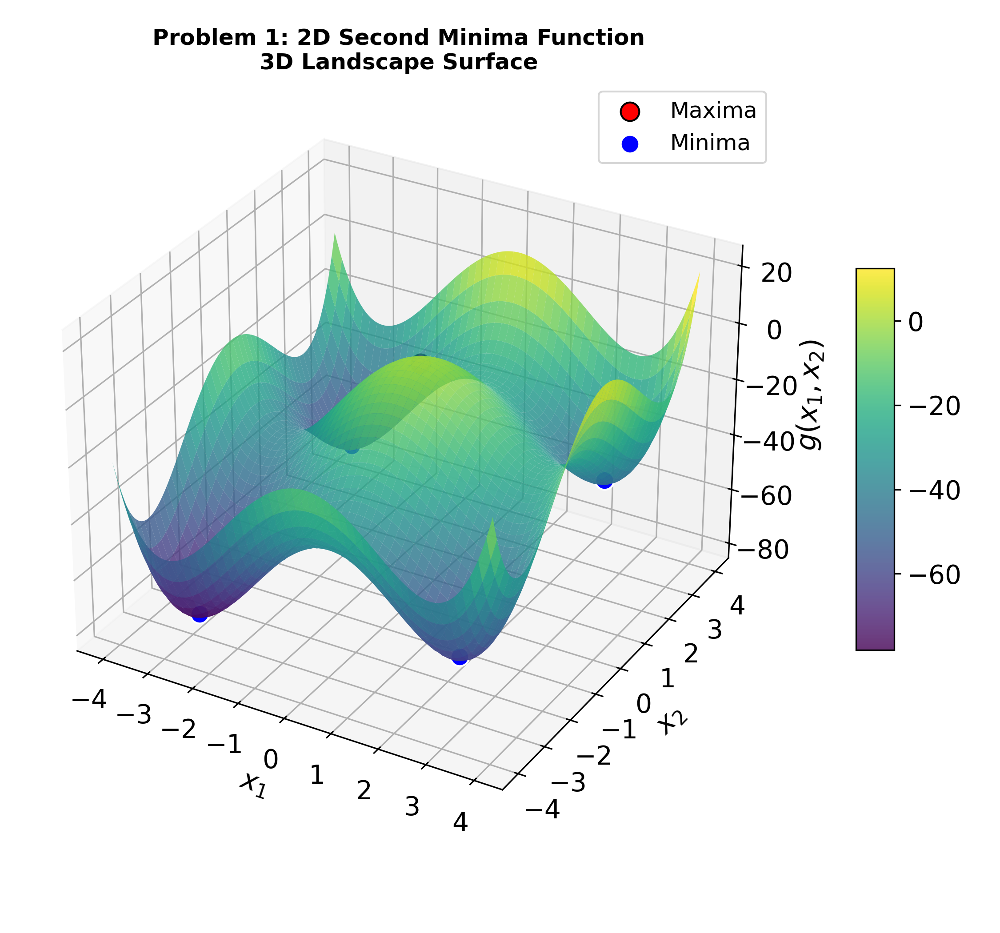
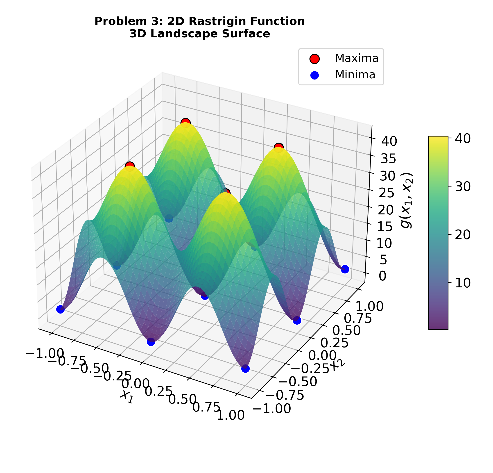
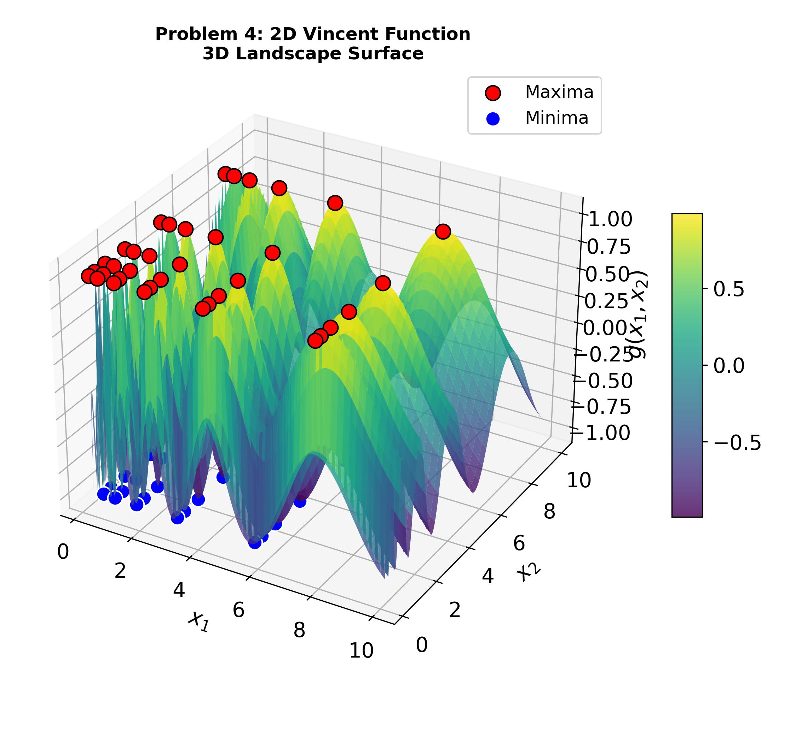
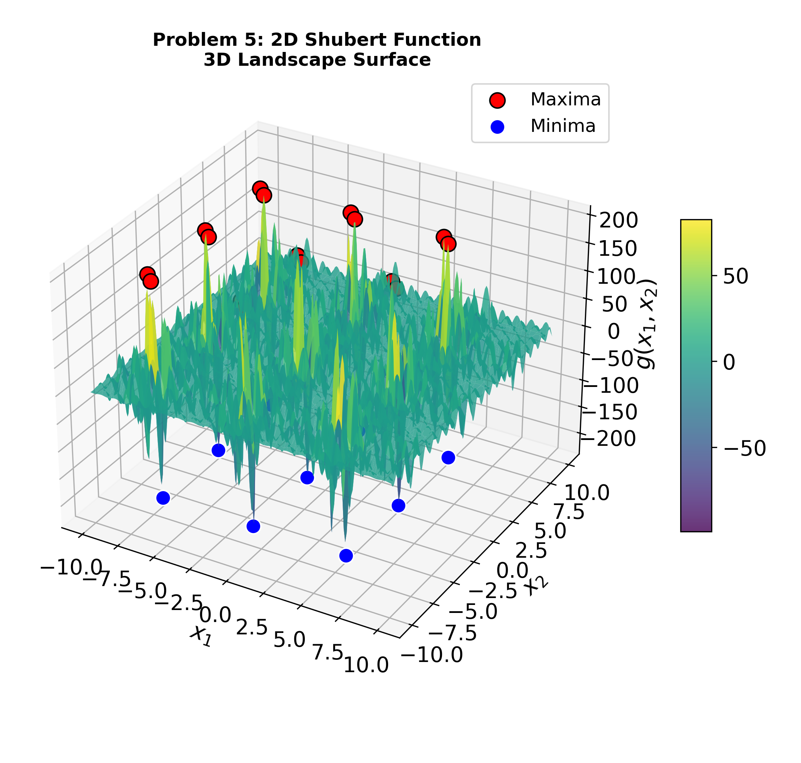
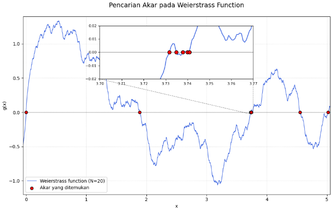

# Visualization

Many problems do not have just one solution waiting to be found. A multimodal
landscape can contain several local and global optima, while a system of
nonlinear equations can have multiple distinct roots within the same bounded
domain. `pysne` is built for this setting: rather than stopping after one
solution, it searches for **all possible roots or optimum points**, using
clustering to identify promising regions and spiral optimization to explore
them simultaneously.

Visualization makes that search easier to understand. The examples on this
page use [matplotlib](https://matplotlib.org) directly to reveal the landscape
first, then—when the solver is involved—place the solutions found by `pysne`
back onto that landscape. The result is a visual connection between the
problem being searched and the roots or optima the algorithm discovers.

## Multimodal landscapes

The visualization adapts to the dimensionality of the problem domain. For two-dimensional problems, the objective landscape is evaluated on a `200×200` grid and rendered as a 3D surface colored by fitness, making its peaks, valleys, and other features visible before the search begins. Higher-dimensional problems use alternative representations suited to spaces that cannot be shown directly as a surface.

### Example: four multimodal benchmark landscapes

These are plots rendered by the script for four of the built-in
problems in `pysne.problems.benchmarks_multimodal`.

**Problem 1: 2D Second Minima Function**
<br>Two shallow global-ish basins with several local minima nearby — a good stress test for finding *all* optima, not just the best one.



**Problem 2: Six-Hump Camel Back**
<br>A classic multimodal benchmark with six local minima, two of which are global.


**Problem 3: 2D Rastrigin Function**
<br>A dense, regular grid of local minima around a single global minimum — highlights why clustering matters before spiral refinement.



**Problem 4: 2D Vincent Function**
<br>A rippled surface of evenly spaced peaks and valleys on a log scale — every peak is a global optimum, making it a clean test of whether the solver finds all of them rather than converging to just one.



**Problem 5: 2D Shubert Function**
<br>A jagged field of 18 global minima surrounded by many local ones — one of the more demanding multimodal benchmarks for exhaustive optima-finding.



### Adapting it to your own problem

The script only touches the public `MultimodalProblem` interface
(`domain` and `g_func`), so it works unmodified on any custom problem —
swap in your own `get_multimodal_problems()`-style dict, or just call
`plot_function` directly:

```python
from visualize_multimodal import plot_function
from my_problems import MyLandscape

plot_function(prob_id=0, problem_func=MyLandscape, save_dir=None)
```

[:material-github: View full source on GitHub](https://github.com/p2ms-optimization/pysne/blob/main/examples/visualize_multimodal.py){ .md-button }

## SNE landscapes + solved roots

[`examples/visualize_sne_results.py`](https://github.com/p2ms-optimization/pysne/blob/main/examples/visualize_sne_results.py)
goes a step further than the multimodal script: it actually **runs the
solver** (`solve_system` from `pysne.solver`) on a chosen `SNEProblem`,
then plots the landscape *with the discovered roots overlaid on top* —
so you can see at a glance whether what `pysne` found lines up with the
actual solution set.

Like the multimodal script, it picks a rendering strategy based on
`problem.n_var` — 1D plots the equation curve with each root marked where
it crosses zero, and 2D draws the zero-level contour of each equation in
the system, overlaying the solver's roots wherever those contours
actually intersect.

It's a CLI tool, run as:

```bash
python visualize_sne_results.py --problem 7 --save_dir ./plots --no_show
```

`--problem` accepts any key from `get_problem_set()` in
`pysne.problems.benchmarks_sne` (currently `1`–`7`); `--no_show` saves the
figure without opening an interactive window, which is what was used to
generate the screenshots below.

### Example: solved roots on three SNE benchmarks

These are real runs — the solver actually executed and its output is what's plotted.

**Problem 1 (2D)**
<br>The red and blue curves are the two equations' zero-level contours — every point they cross is a true root of the system. The solver found 6 roots, matching the visible intersections.


**Problem 2 (2D)**
<br>A denser system than Problem 1 — the two contours weave across each other 12 times, and `solve_system` recovered all 12 intersections.


**Problem 7 (1D, Weierstrass-based)**
<br>`solve_system` found all 9 roots (fitness 1.000000 on each); every zero-crossing of the curve has a marker on it.



[:material-github: View full source on GitHub](https://github.com/p2ms-optimization/pysne/blob/main/examples/visualize_sne_results.py){ .md-button }

!!! note
    This script isn't in the `pysne` repository yet — add it to `examples/`
    alongside `visualize_multimodal.py` for the GitHub source link above
    to resolve.
