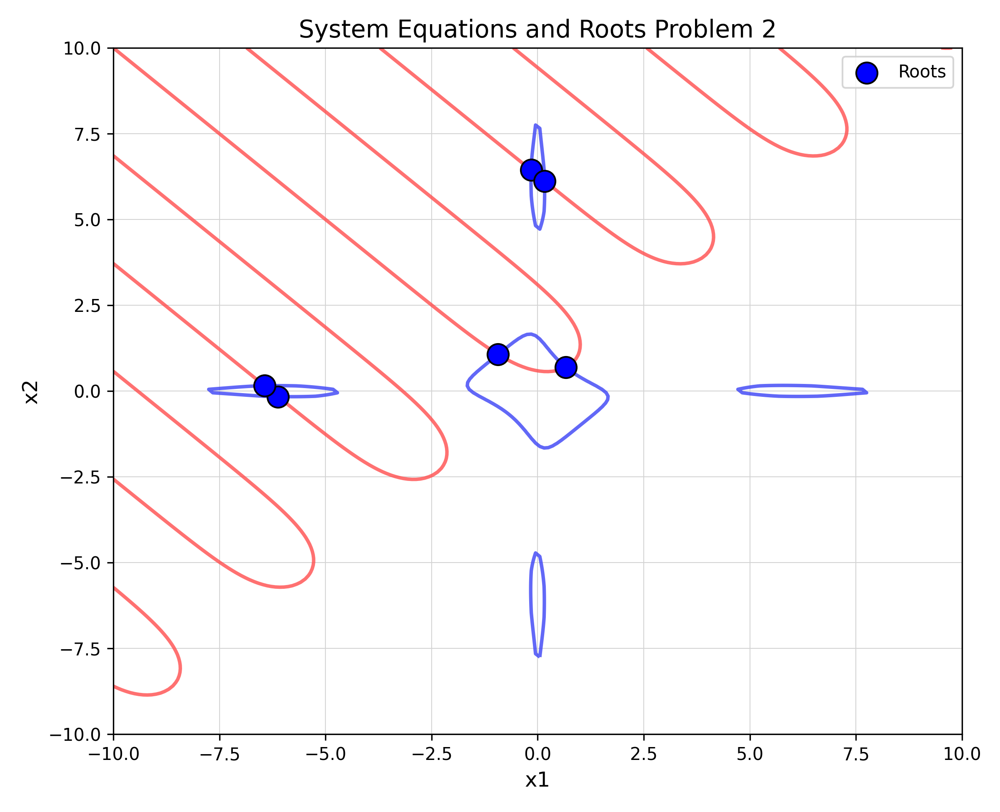
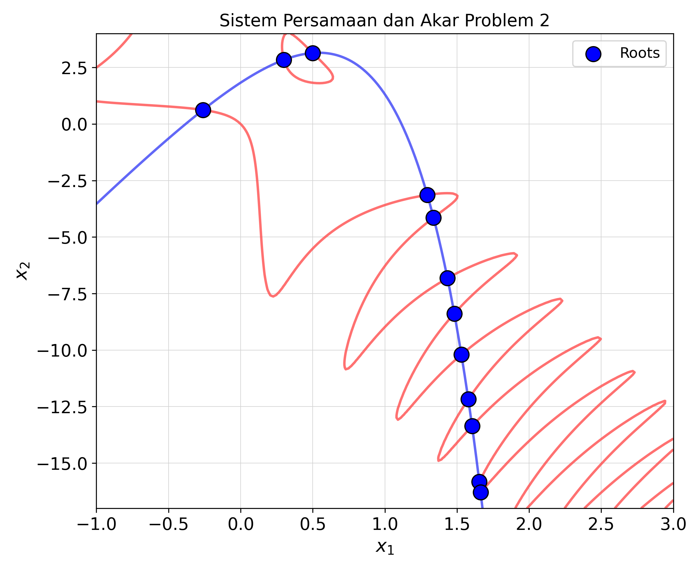
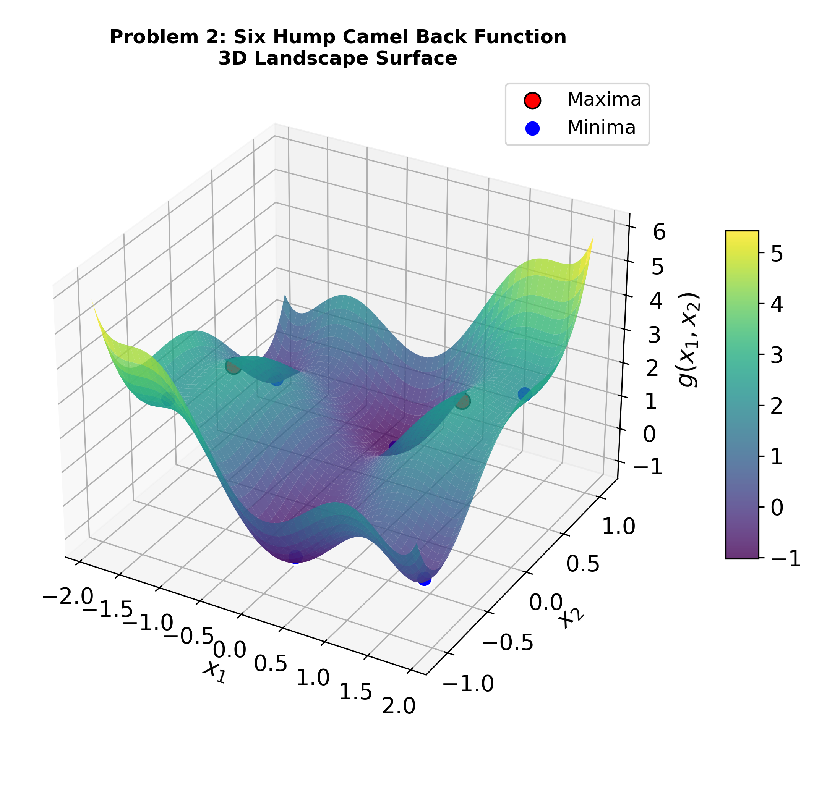

# Visualization & Landscape Analysis

Visualization is an essential tool in optimization and system solving. It translates abstract mathematical landscapes—such as multimodal objective spaces with multiple local/global optima or non-linear equation systems with multiple roots—into intuitive visual representations.

`pysne` provides visualization tools built directly on top of [matplotlib](https://matplotlib.org). You can run these tools as ready-to-use Command Line Interface (CLI) scripts or import their visualization functions into your own Python scripts.

---

## Overview of Visualization Tools

| Visualization Mode | Target Problem | Dimensionality | Description |
| :--- | :--- | :--- | :--- |
| **SNE Equation Contours** | `SNEProblem` | 1D & 2D | Plots zero-level equation contours ($f_i(\mathbf{x}) = 0$) and overlays solver-discovered roots at contour intersections. |
| **SNE Fitness Scatter** | `SNEProblem` | 3D | 3D scatter plot thresholded at top fitness regions with 3D root markers. |
| **Multimodal Surface & Heatmap** | `MultimodalProblem` | 2D | Side-by-side 3D Surface landscape and 2D Contour Heatmap with overlaid maxima and minima. |
| **Multimodal 3D & Cross-Sections** | `MultimodalProblem` | 3D | 3D thresholded scatter plot accompanied by 2D cross-sectional slice heatmaps. |

---

## Quick Start Tutorial (CLI Usage)

Like `pymoo`, `pysne` visualizers act as convenient wrappers around `matplotlib`. You can execute them directly from your terminal.

### 1. Visualizing SNE Systems & Discovered Roots

Run `visualize_sne_results.py` to solve an SNE benchmark problem and plot its zero-level equation contours overlaid with roots:

```bash
python examples/visualize_sne_results.py --problem 1 --save_dir ./plots --no_show
```

**Output Plot:**


```bash
python examples/visualize_sne_results.py --problem 2 --save_dir ./plots --no_show
```

**Output Plot:**


---

### 2. Visualizing Multimodal Landscapes & Optima

Run `visualize_multimodal_results.py` to inspect multimodal landscapes and overlay discovered maxima and minima:

```bash
python examples/visualize_multimodal_results.py --problem 2 --save_dir ./plots --no_show
```

**Output Plot:**


---

## Command Line Arguments Reference

| Argument | Type | Default | Description |
| :--- | :--- | :--- | :--- |
| `--problem` | `str` / `int` | `1` (SNE) / `2` (Multimodal) | Problem key/ID from benchmark problem sets (`benchmarks_sne` or `benchmarks_multimodal`). |
| `--save_dir` | `str` | `.` | Directory path where output PNG images will be saved. |
| `--no_show` | `flag` | `False` | When set, saves figures directly to disk without displaying interactive pop-up windows. |

---

## Custom Problem Tutorial (Python API)

You can import `pysne` visualization functions into your custom Python workflows just like in `pymoo`.

### Example 1: Custom Multimodal Landscape

```python
import numpy as np
from pysne.problems.base import MultimodalProblem
from examples.visualize_multimodal_results import plot_2d_results

class MyCustomMultimodal(MultimodalProblem):
    def __init__(self):
        super().__init__(name="My Custom Landscape", n_var=2, optima_type="both")
    
    def get_info(self):
        domain = [(-3.0, 3.0), (-3.0, 3.0)]
        return domain, {}

    def g_func(self, X):
        X = np.atleast_2d(X)
        x1, x2 = X[:, 0], X[:, 1]
        return np.sin(x1) * np.cos(x2)

# Instantiate problem and define discovered optima points
prob = MyCustomMultimodal()
maxima = np.array([[np.pi/2, 0.0]])
minima = np.array([[-np.pi/2, 0.0]])

# Render 3D Surface + 2D Contour plot
plot_2d_results(prob, maxima, minima, save_path="custom_multimodal_results.png")
```

---

### Example 2: Custom Non-linear System of Equations (SNE)

```python
import numpy as np
from pysne.problems.base import SNEProblem
from examples.visualize_sne_results import plot_2d_results

class MySNESystem(SNEProblem):
    def __init__(self):
        super().__init__(name="Circle & Line System", n_var=2)
        # Define equations f1(x) = 0 and f2(x) = 0
        self.equations = [
            lambda x: x[0]**2 + x[1]**2 - 4,  # Circle of radius 2
            lambda x: x[0] - x[1]             # Line x1 = x2
        ]
        
    def get_info(self):
        domain = [(-3.0, 3.0), (-3.0, 3.0)]
        return domain, {}

# Instantiate problem and roots found by solver
prob = MySNESystem()
roots = np.array([
    [np.sqrt(2), np.sqrt(2)],
    [-np.sqrt(2), -np.sqrt(2)]
])

# Render zero-contour plot with overlaid roots
plot_2d_results(prob, roots, save_path="custom_sne_results.png")
```

---

[:material-github: View Source code for SNE Visualizer on GitHub](https://github.com/p2ms-optimization/pysne/blob/main/examples/visualize_sne_results.py){ .md-button }
[:material-github: View Source code for Multimodal Visualizer on GitHub](https://github.com/p2ms-optimization/pysne/blob/main/examples/visualize_multimodal_results.py){ .md-button }
