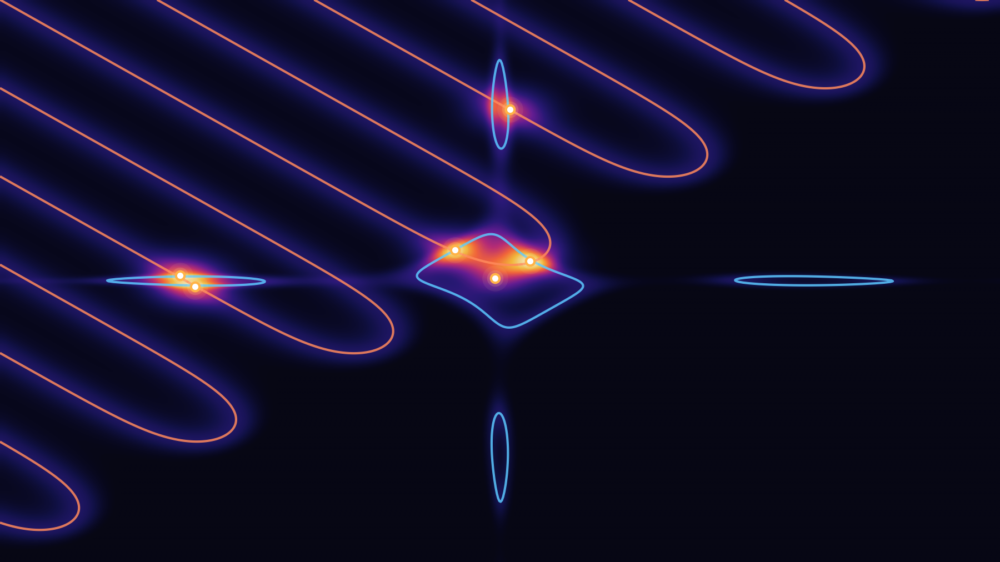
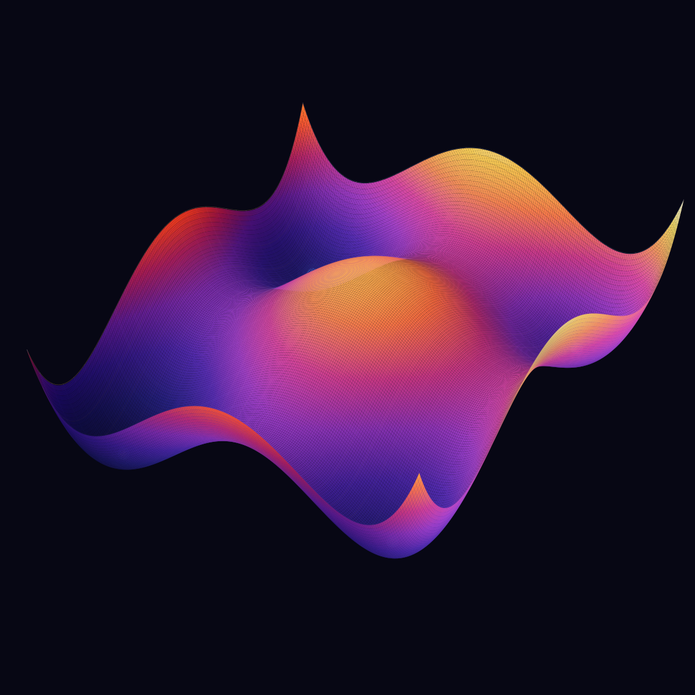

---
hide:
  - toc
---

  

    Open-Source Python Library
    

      
    

    
Every Root, Every Optimum

    
Nonlinear Systems · Diophantine Equations · Multimodal Functions

    

      PySNE is an open-source Python framework built on the <strong>Spiral Optimization with Clustering (SPOC)</strong> algorithm. It solves three classes of hard problems in a single, unified pipeline: <strong>nonlinear root finding</strong> (find all roots of <em>F</em>(<strong>x</strong>) = 0), <strong>Diophantine equations</strong> (find integer solutions of polynomial, exponential, and mixed systems), and <strong>multimodal optimization</strong> (locate all local and global optima). With interactive visualization and reproducible benchmarks, PySNE is designed for both research and education.
    

    

      <a class="md-button md-button--primary" href="getting-started/">Get Started →</a>
      <a class="md-button" href="github/">View on GitHub</a>
    

  

  

    <svg class="pysne-surface-svg" viewBox="0 0 760 440" xmlns="http://www.w3.org/2000/svg" role="img" aria-label="Multimodal surface with roots visualization">
      <defs>
        <!-- Deep blue-purple to orange-red gradient (inspired by reference image) -->
        <linearGradient id="surf-deep" x1="0" y1="1" x2="1" y2="0">
          <stop offset="0" stop-color="#1a0a3e"/>
          <stop offset=".3" stop-color="#2d1b69"/>
          <stop offset=".55" stop-color="#4834a6"/>
          <stop offset=".75" stop-color="#e85d26"/>
          <stop offset="1" stop-color="#ff9a44"/>
        </linearGradient>
        <linearGradient id="surf-glow" x1="0" y1="0" x2="1" y2="1">
          <stop offset="0" stop-color="#6c3bd5" stop-opacity=".6"/>
          <stop offset=".5" stop-color="#e85d26" stop-opacity=".45"/>
          <stop offset="1" stop-color="#ff6b35" stop-opacity=".3"/>
        </linearGradient>
        <linearGradient id="surf-base" x1="0" y1="1" x2="0" y2="0">
          <stop offset="0" stop-color="#0d0628"/>
          <stop offset=".6" stop-color="#1e1152"/>
          <stop offset="1" stop-color="#2d1b69"/>
        </linearGradient>
        <radialGradient id="glow-root" cx="50%" cy="50%" r="60%">
          <stop offset="0" stop-color="#ffffff" stop-opacity="1"/>
          <stop offset=".35" stop-color="#7dd3fc" stop-opacity=".7"/>
          <stop offset="1" stop-color="#0ea5e9" stop-opacity="0"/>
        </radialGradient>
        <radialGradient id="glow-int" cx="50%" cy="50%" r="60%">
          <stop offset="0" stop-color="#ffffff" stop-opacity="1"/>
          <stop offset=".35" stop-color="#a5f3c4" stop-opacity=".7"/>
          <stop offset="1" stop-color="#22c55e" stop-opacity="0"/>
        </radialGradient>
        <radialGradient id="glow-opt" cx="50%" cy="50%" r="60%">
          <stop offset="0" stop-color="#ffffff" stop-opacity="1"/>
          <stop offset=".35" stop-color="#fbbf24" stop-opacity=".7"/>
          <stop offset="1" stop-color="#f97316" stop-opacity="0"/>
        </radialGradient>
        <filter id="blur-glow" x="-50%" y="-50%" width="200%" height="200%">
          <feGaussianBlur in="SourceGraphic" stdDeviation="6"/>
        </filter>
        <filter id="blur-soft" x="-30%" y="-30%" width="160%" height="160%">
          <feGaussianBlur in="SourceGraphic" stdDeviation="3"/>
        </filter>
      </defs>

      <!-- Background -->
      <rect width="760" height="440" rx="18" fill="#0d0628"/>

      <!-- Particle dot field (subtle background dots) -->
      <g opacity=".18">
        <circle cx="80" cy="60" r="1.2" fill="#7c6bc4"/><circle cx="150" cy="40" r="1" fill="#8b7fd4"/>
        <circle cx="220" cy="75" r="1.3" fill="#6d5bb5"/><circle cx="310" cy="35" r="1.1" fill="#9b8fe4"/>
        <circle cx="380" cy="55" r="1" fill="#7c6bc4"/><circle cx="460" cy="70" r="1.2" fill="#8b7fd4"/>
        <circle cx="530" cy="42" r="1.1" fill="#6d5bb5"/><circle cx="610" cy="65" r="1" fill="#9b8fe4"/>
        <circle cx="680" cy="48" r="1.3" fill="#7c6bc4"/><circle cx="120" cy="380" r="1" fill="#6d5bb5"/>
        <circle cx="260" cy="400" r="1.2" fill="#7c6bc4"/><circle cx="400" cy="390" r="1.1" fill="#8b7fd4"/>
        <circle cx="540" cy="405" r="1" fill="#9b8fe4"/><circle cx="640" cy="385" r="1.2" fill="#6d5bb5"/>
      </g>

      <g transform="translate(50,30)">
        <!-- Surface body (3D isometric multimodal surface) -->
        <!-- Base shadow -->
        <path d="M60 320 C130 310 210 315 290 310 S430 305 530 315 L600 330 C520 340 400 335 290 340 S130 345 60 340 Z" fill="#0d0628" opacity=".6"/>

        <!-- Main surface with multiple peaks -->
        <path d="M80 280 C100 180 140 100 180 80 C210 65 230 100 250 170 C270 230 290 260 320 200 C340 150 360 90 390 70 C420 55 440 80 460 140 C480 200 500 240 530 210 C550 185 570 150 590 170 L600 280 C530 300 420 310 290 310 S130 300 80 280 Z" fill="url(#surf-deep)" opacity=".92"/>

        <!-- Surface highlight layer -->
        <path d="M80 280 C100 180 140 100 180 80 C210 65 230 100 250 170 C270 230 290 260 320 200 C340 150 360 90 390 70 C420 55 440 80 460 140 C480 200 500 240 530 210 C550 185 570 150 590 170 L600 280" fill="none" stroke="url(#surf-glow)" stroke-width="3"/>

        <!-- Depth surface (bottom portion) -->
        <path d="M80 280 C130 300 200 310 290 310 S460 305 600 280 L600 310 C460 330 310 340 290 340 S130 330 80 310 Z" fill="url(#surf-base)" opacity=".85"/>

        <!-- Wireframe contour lines across surface -->
        <g opacity=".2" fill="none" stroke="#b794f6" stroke-width=".8">
          <path d="M100 260 C130 200 160 140 190 110 C220 140 250 200 280 230"/>
          <path d="M200 260 C230 200 260 160 290 210 C320 170 340 120 370 95"/>
          <path d="M350 260 C380 190 400 110 420 90 C450 120 470 170 490 210"/>
          <path d="M470 250 C490 210 510 180 530 210 C550 190 570 165 585 175"/>
        </g>

        <!-- Horizontal contour lines -->
        <g opacity=".12" fill="none" stroke="#c4b5fd" stroke-width=".6">
          <path d="M95 240 C180 200 280 220 380 190 S520 210 590 230"/>
          <path d="M100 200 C170 160 250 180 340 140 S480 160 580 190"/>
          <path d="M120 160 C180 120 240 140 320 110 S460 130 560 155"/>
        </g>

        <!-- Dot particle field on surface -->
        <g opacity=".3">
          <circle cx="110" cy="250" r="1.5" fill="#8b5cf6"/><circle cx="140" cy="190" r="1.2" fill="#a78bfa"/>
          <circle cx="170" cy="120" r="1.4" fill="#c4b5fd"/><circle cx="200" cy="150" r="1.3" fill="#a78bfa"/>
          <circle cx="230" cy="200" r="1.5" fill="#8b5cf6"/><circle cx="260" cy="230" r="1.2" fill="#7c3aed"/>
          <circle cx="300" cy="210" r="1.4" fill="#a78bfa"/><circle cx="330" cy="170" r="1.3" fill="#c4b5fd"/>
          <circle cx="360" cy="120" r="1.5" fill="#ddd6fe"/><circle cx="400" cy="90" r="1.2" fill="#e9d5ff"/>
          <circle cx="430" cy="120" r="1.4" fill="#c4b5fd"/><circle cx="460" cy="170" r="1.3" fill="#a78bfa"/>
          <circle cx="490" cy="220" r="1.5" fill="#8b5cf6"/><circle cx="520" cy="215" r="1.2" fill="#7c3aed"/>
          <circle cx="550" cy="195" r="1.4" fill="#a78bfa"/><circle cx="575" cy="175" r="1.3" fill="#c4b5fd"/>
        </g>

        <!-- ═══ SOLUTION MARKERS ═══ -->

        <!-- Root Finding markers (cyan/blue glow) — nonlinear roots -->
        <g>
          <circle cx="180" cy="80" r="18" fill="url(#glow-root)" filter="url(#blur-glow)" opacity=".6"/>
          <circle cx="180" cy="80" r="7" fill="#0ea5e9" stroke="#ffffff" stroke-width="2.5"/>
          <text x="180" y="62" text-anchor="middle" fill="#7dd3fc" font-size="10" font-weight="700" font-family="Inter, sans-serif">root</text>
        </g>
        <g>
          <circle cx="520" cy="210" r="16" fill="url(#glow-root)" filter="url(#blur-glow)" opacity=".5"/>
          <circle cx="520" cy="210" r="6" fill="#0ea5e9" stroke="#ffffff" stroke-width="2.5"/>
        </g>

        <!-- Diophantine integer markers (green glow) — integer grid points -->
        <g>
          <circle cx="310" cy="200" r="16" fill="url(#glow-int)" filter="url(#blur-glow)" opacity=".5"/>
          <rect x="303" y="193" width="14" height="14" rx="3" fill="#22c55e" stroke="#ffffff" stroke-width="2"/>
          <text x="310" y="183" text-anchor="middle" fill="#86efac" font-size="10" font-weight="700" font-family="Inter, sans-serif">ℤ</text>
        </g>
        <g>
          <circle cx="460" cy="140" r="14" fill="url(#glow-int)" filter="url(#blur-glow)" opacity=".4"/>
          <rect x="454" y="134" width="12" height="12" rx="3" fill="#22c55e" stroke="#ffffff" stroke-width="2"/>
        </g>

        <!-- Multimodal optimum markers (orange/gold glow) — peaks -->
        <g>
          <circle cx="390" cy="70" r="20" fill="url(#glow-opt)" filter="url(#blur-glow)" opacity=".6"/>
          <polygon points="390,58 395,68 405,70 397,77 399,87 390,82 381,87 383,77 375,70 385,68" fill="#f97316" stroke="#ffffff" stroke-width="1.5"/>
          <text x="390" y="50" text-anchor="middle" fill="#fbbf24" font-size="10" font-weight="700" font-family="Inter, sans-serif">optimum</text>
        </g>
        <g>
          <circle cx="575" cy="170" r="14" fill="url(#glow-opt)" filter="url(#blur-glow)" opacity=".4"/>
          <polygon points="575,162 578,168 584,169 580,173 581,179 575,176 569,179 570,173 566,169 572,168" fill="#f97316" stroke="#ffffff" stroke-width="1.5"/>
        </g>

        <!-- Legend -->
        <g transform="translate(15, 350)">
          <circle cx="0" cy="0" r="5" fill="#0ea5e9" stroke="#fff" stroke-width="1.5"/>
          <text x="10" y="4" fill="#94a3b8" font-size="10" font-family="Inter, sans-serif">Roots</text>
          <rect x="60" y="-5" width="10" height="10" rx="2" fill="#22c55e" stroke="#fff" stroke-width="1.5"/>
          <text x="76" y="4" fill="#94a3b8" font-size="10" font-family="Inter, sans-serif">Integer</text>
          <polygon points="145,-5 148,1 154,2 150,6 151,12 145,9 139,12 140,6 136,2 142,1" fill="#f97316" stroke="#fff" stroke-width="1"/>
          <text x="160" y="4" fill="#94a3b8" font-size="10" font-family="Inter, sans-serif">Optima</text>
        </g>
      </g>
    </svg>
  

<!-- ═══ CAPABILITY CARDS ═══ -->

  <a class="pysne-card pysne-card--link" href="case-studies/nonlinear-systems/">
    √
    <h3>Nonlinear Root Finding</h3>
    
Find <strong>all roots</strong> of systems of nonlinear equations — from 1D oscillatory functions to 8D combustion systems with 16 roots.

  </a>
  <a class="pysne-card pysne-card--link" href="case-studies/diophantine-equations/">
    ℤ
    <h3>Diophantine Equations</h3>
    
Discover <strong>integer solutions</strong> to polynomial, exponential, Markoff-Hurwitz, and Ramanujan-Nagell type equations.

  </a>
  <a class="pysne-card pysne-card--link" href="case-studies/multimodal-benchmarks/">
    ⛰
    <h3>Multimodal Optimization</h3>
    
Locate <strong>every optimum</strong> — maxima and minima — of highly non-convex functions like Rastrigin, Shubert, and Griewank.

  </a>
  <a class="pysne-card pysne-card--link" href="examples/visualization/">
    ↗
    <h3>Interactive Visualization</h3>
    
Explore solution landscapes, convergence paths, and basins of attraction with built-in plotting tools.

  </a>

<h2 class="pysne-section-title">Explore PySNE</h2>

  <a class="pysne-mini-card" href="getting-started/">🚀
<h3>Getting Started</h3>
Install PySNE and solve your first system.

</a>
  <a class="pysne-mini-card" href="examples/">▦
<h3>Examples</h3>
Browse examples of nonlinear systems.

</a>
  <a class="pysne-mini-card" href="case-studies/">▥
<h3>Case Studies</h3>
Real-world problems and solutions.

</a>
  <a class="pysne-mini-card" href="research/">⚗
<h3>Research</h3>
Papers, preprints, and references.

</a>

  

    

      
    

    
<h3>Visualization & Landscape Analysis</h3>
Plot contour landscapes, 3D fitness surfaces, and overlay discovered roots with matplotlib.

<a href="examples/visualization/">Explore Visualizations →</a>

  

  

    

      <svg viewBox="0 0 460 170" xmlns="http://www.w3.org/2000/svg"><rect width="460" height="170" fill="#062b4f"/><circle cx="230" cy="85" r="28" fill="#ef1f1f"/><polygon points="222,70 222,100 248,85" fill="#fff"/><g stroke="#38bdf8" opacity=".45"><line x1="70" y1="40" x2="165" y2="110"/><line x1="165" y1="110" x2="280" y2="60"/><line x1="280" y1="60" x2="390" y2="120"/></g></svg>
    

    
<h3>PySNE Tutorial Series</h3>
Step-by-step video tutorials from installation to solving Diophantine and multimodal problems.

<a href="examples/pysne-tutorial-series/">Watch Tutorials →</a>

  

  

    

      
    

    
<h3>Benchmark Gallery</h3>
SNE systems, Diophantine equations, and multimodal functions — all solved and visualized.

<a href="case-studies/">Browse Case Studies →</a>

  

